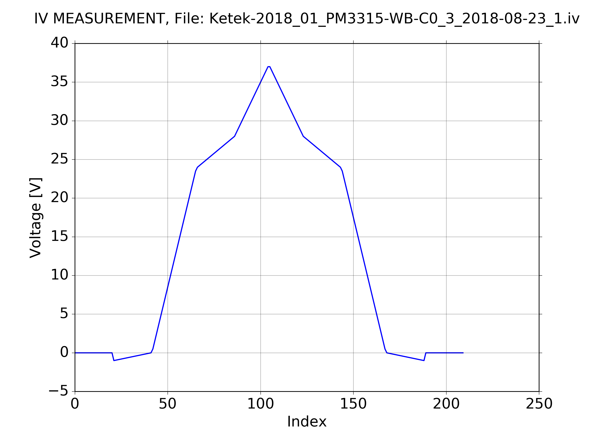

How to make cold_chuck_plots
****************************

The module cold_chuck_plots.py contains classes to read, plot
and analyse data-files from CV- and IV-measurements of silicon
particle detectors created by one the cold chuck setups. The following
plots are predefined:

IV-plot
^^^^^^^

Here is an example how to create a simple IV-plot
with only 12 lines of Python code
(source code in file ``demo_iv.py``, result in Fig. 2.1 left).

.. code-block:: python
    :linenos:

    #!/usr/bin/env python3
    # -*- coding: utf-8 -*-
    from pyhaha import *                   # Environment variable $PYTHONPATH
                                           # points to relevant folder
    my_dir = './data_dir'                  # here are all my .iv and .cv files
    datafile = 'FTH200N_04_DiodeS_14_2015-11-06_7.iv'
    ccd = ColdChuckData(datafile, my_dir)  # create a data file object
    print(ccd.get_filepath())              # where the file finally was found
    p = IVPlot(ccd)                        # create plot object
    p.make_plot()                          # create the plot
    # plt.semilogy()                       # optional
    p.save_plot()                          # save plot as .pdf
    plt.show()                             # show plot

    IV-plots based on single (left) and mutilple (right) datafiles

All the built-in xxxPlot-classes can also handle mutiple datafiles, see the
following example (source code in file ``demo_multi_iv.py``, result
in Fig. 2.1 right).

.. code-block:: python
    :linenos:

    #!/usr/bin/env python3
    # -*- coding: utf-8 -*-
    from pyhaha import *                   # Environment variable $PYTHONPATH
                                           # points to relevant folder
    my_dir = './data_dir'                  # here are all my .iv and .cv files
    my_files  = ['MCZ200Y_05_DiodeL_9_2012-08-08_4.iv',
                 'MCZ200Y_06_DiodeL_11_2012-08-09_4.iv',
                 'MCZ200Y_07_DiodeL_8_2012-08-13_4.iv']
    my_labels = [r'$3\cdot 10^{13}$ neq cm${}^{-2}$',
                 r'$5\cdot 10^{13}$ neq cm${}^{-2}$',
                 r'$1\cdot 10^{14}$ neq cm${}^{-2}$']
    ccds = []                               # list of data file objects
    for my_file in my_files:
        ccd = ColdChuckData(my_file, directory=my_dir) # create an object for each
        ccds.append(ccd)                    # and collect in a list
        print(ccd.get_filepath())           # where the file finally was found
    p = IVPlot(ccds, params={'legend.fontsize': 'small'}) # create plot object
    p.make_plot(my_labels, 1e6, r'$\mu$A')  # create the plot
    # plt.semilogy()                        # optional
    p.save_plot()                           # save plot as .pdf
    plt.show()                              # show plot

Voltage-plot
^^^^^^^^^^^^

Here is an example how to create a simple Voltage-plot. Voltage-plots are
useful to get an overview over the indexes of the numpy-arrays
(source code in file ``demo_voltage.py``, result in Fig. 2.2).

.. code-block:: python
    :linenos:

    #!/usr/bin/env python3
    # -*- coding: utf-8 -*-
    from pyhaha import *                   # Environment variable $PYTHONPATH
                                           # points to relevant folder
    my_dir = './data_dir'                  # here are all my .iv and .cv files
    datafile = 'Ketek-2018_01_PM3315-WB-C0_3_2018-08-23_1.iv'
    ccd = ColdChuckData(datafile, my_dir)  # create a data file object
    print(ccd.get_filepath())              # where the file finally was found
    p = VoltagePlot(ccd)                   # create plot object
    p.make_plot()                          # create the plot
    p.save_plot()                          # save plot as .pdf
    plt.show()                             # show plot

    Voltage plot: Voltage versus index of the numpy-array

CV-plot
^^^^^^^

Here an example for a standard CV-plot :math:`\frac{1}{C^2}`
versus :math:`V_{Bias}` with few code lines (source code in
file ``demo_cv.py``, result in Fig. 2.3 left).

.. code-block:: python
    :linenos:

    #!/usr/bin/env python3
    # -*- coding: utf-8 -*-
    from pyhaha import *                   # Environment variable $PYTHONPATH
                                           # points to relevant folder
    my_dir = './data_dir'                  # here are all my .iv and .cv files
    datafile = 'FTH200N_04_DiodeS_14_2015-11-05_4.cv'
    ccd = ColdChuckData(datafile, my_dir)  # create a data file object
    print(ccd.get_filepath())              # where the file finally was found
    p = CVPlot(ccd)                        # create plot object
    p.make_plot()                          # create the plot
    p.save_plot()                          # save plot as .pdf
    plt.show()                             # show plot

    CV-plots based on single (left) and mutilple (right) datafiles

Similarly, a standard CV-plot with multiple datafiles (source code in file
``demo_multi_cv.py``, result in Fig. 2.3 right):

.. code-block:: python
    :linenos:

    #!/usr/bin/env python3
    # -*- coding: utf-8 -*-
    from pyhaha import *                   # Environment variable $PYTHONPATH
                                           # points to relevant folder
    my_dir = './data_dir'                  # here are all my .iv and .cv files
    my_files  = ['MCZ200Y_05_DiodeL_9_2012-08-08_4.cv',
                 'MCZ200Y_06_DiodeL_11_2012-08-09_4.cv',
                 'MCZ200Y_07_DiodeL_8_2012-08-13_4.cv']
    my_labels = [r'$3\cdot 10^{13}$ neq cm${}^{-2}$',
                 r'$5\cdot 10^{13}$ neq cm${}^{-2}$',
                 r'$1\cdot 10^{14}$ neq cm${}^{-2}$']
    ccds = []                               # list of data file objects
    for my_file in my_files:
        ccd = ColdChuckData(my_file, directory=my_dir) # create an object for each
        ccds.append(ccd)                    # and collect in a list
        print(ccd.get_filepath())           # where the file finally was found
    p = CVPlot(ccds)                        # create plot object
    p.update_params({'legend.fontsize': 'medium'})
    p.make_plot(my_labels)                  # create the plot
    p.save_plot()                           # save plot as .pdf
    plt.show()                              # show plot

Cf-plot
^^^^^^^

And here another example how to create the standard Cf-plot
:math:`C_p` versus :math:`f` for a few voltages provided as parameter
(source code in file ``demo_cf.py``, result in Fig. 2.4 left).

.. code-block:: python
    :linenos:

    #!/usr/bin/env python3
    # -*- coding: utf-8 -*-
    from pyhaha import *                   # Environment variable $PYTHONPATH
                                           # points to relevant folder
    my_dir = './data_dir'                  # here are all my .iv and .cv files
    datafile = 'FTH200N_04_DiodeS_14_2015-11-05_4.cv'
    ccd = ColdChuckData(datafile, my_dir)  # create a data file object
    print(ccd.get_filepath())              # where the file finally was found
    p = CfPlot(ccd)                        # create plot object
    p.make_plot([5, 20, 50, 100, 200])     # create the plot for some voltages
    p.save_plot()                          # save plot as .pdf
    plt.show()                             # show plot

    Cf-plots based on single (left) and mutilple (right) datafiles

The same with multiple datafiles (source code in file
``demo_multi_cf.py``, result in Fig. 2.4 right):

.. code-block:: python
    :linenos:

    #!/usr/bin/env python3
    # -*- coding: utf-8 -*-
    from pyhaha import *                   # Environment variable $PYTHONPATH
                                           # points to relevant folder
    my_dir = './data_dir'                  # here are all my .iv and .cv files
    my_files  = ['MCZ200Y_05_DiodeL_9_2012-08-08_4.cv',
                 'MCZ200Y_06_DiodeL_11_2012-08-09_4.cv',
                 'MCZ200Y_07_DiodeL_8_2012-08-13_4.cv']
    my_labels = [r'$3\cdot 10^{13}$ neq cm${}^{-2}$',
                 r'$5\cdot 10^{13}$ neq cm${}^{-2}$',
                 r'$1\cdot 10^{14}$ neq cm${}^{-2}$']
    ccds = []                               # list of data file objects
    for my_file in my_files:
        ccd = ColdChuckData(my_file, directory=my_dir) # create an object for each
        ccds.append(ccd)                    # and collect in a list
        print(ccd.get_filepath())           # where the file finally was found
    p = CfPlot(ccds, params={'legend.fontsize': 'small'}) # create plot object
    p.make_plot([5, 20, 50, 100, 200], my_labels) # create the plot for some voltages
    p.save_plot()                           # save plot as .pdf
    plt.show()                              # show plot

Yf- or Zf-plot
^^^^^^^^^^^^^^
Here a double logarithmic plot of impedance versus frequency for some voltages
(source code in file ``demo_yzf.py``, result in Fig. 2.5).

.. code-block:: python
    :linenos:

    #!/usr/bin/env python3
    # -*- coding: utf-8 -*-
    from pyhaha import *                   # Environment variable $PYTHONPATH
                                           # points to relevant folder
    my_dir = './data_dir'                  # here are all my .iv and .cv files
    datafile = 'FTH200N_04_DiodeS_14_2015-11-05_4.cv'
    ccd = ColdChuckData(datafile, my_dir)  # create a data file object
    print(ccd.get_filepath())               # where the file finally was found
    p = YZfPlot(ccd)                        # create plot object
    p.make_plot([5, 20, 50, 100, 200], plot_type='Z') # create impedance plot
    p.save_plot()                           # save plot as .pdf
    plt.show()                              # show plot

    Impedance versus frequency plot

More sophisticated plots
^^^^^^^^^^^^^^^^^^^^^^^^

Here a plot consisting of two double logarithmic subplots for serial
and parallel resistance versus frequency
(source code in file ``demo_rs_rp.py``, result in Fig. 2.6).

.. code-block:: python
    :linenos:

    #!/usr/bin/env python3
    # -*- coding: utf-8 -*-
    from pyhaha import *                   # Environment variable $PYTHONPATH
                                           # points to relevant folder
    my_dir = './data_dir'                  # here are all my .iv and .cv files
    datafile = 'w1-pm1125-2_2013-07-24_4.cv'
    ccd = ColdChuckData(datafile, my_dir)  # create a data file object
    print(ccd.get_filepath())              # where the file finally was found
    rs = ccd.get_rs()                      # serial resistance
    rp = 1.0 / ccd.get_gp()                # parallel resistance from admittance
    freqs = ccd.get_frequencies()          # all frequencies
    voltages = [4, 8, 12, 14, 16, 20, 24, 26] # plot only these voltages
    p = CVPlot(ccd)                        # create plot object
    volt_indices = ccd.v_index(voltages)
    fig = plt.figure(figsize=[11.0, 12.0])
    fig.text(0.5, 0.98, p.make_title(), ha='center', va='top')
    # First Subplot
    plt.subplot(2, 1, 1)
    plt.title('Serial Resistance versus Frequency')
    for vi in volt_indices:
        v_label = "{} V".format(ccd.get_volts()[vi])
        plt.plot(freqs, rs[vi, :], label=v_label)
    plt.ylabel(r'Resistance $R_s$ [$\Omega$]')
    plt.loglog()
    plt.legend(loc='best')
    # Second Subplot
    plt.subplot(2, 1, 2)
    plt.title('Parallel Resistance versus Frequency')
    for vi in volt_indices:
        v_label = "{} V".format(ccd.get_volts()[vi])
        plt.plot(freqs, rp[vi, :], label=v_label)
    plt.xlabel('Frequency [Hz]')
    plt.ylabel(r'Resistance $R_p$ [$\Omega$]')
    plt.loglog()
    plt.legend(loc='best')
    # Show and save all
    p.save_plot()                          # save plot as .pdf
    plt.show()                             # show plot

    Log-log plot of serial and parallel resistance versus frequency

Limited Voltage Range
^^^^^^^^^^^^^^^^^^^^^

Many of the return values of the methods in class ColdChuckData
and many of the plots can be restriced to a limited range of voltages.
For details have a look at the documentation
of the methods ``set_voltage_index_range`` and ``set_voltage_range``
in the class ``ColdChuckData``.
