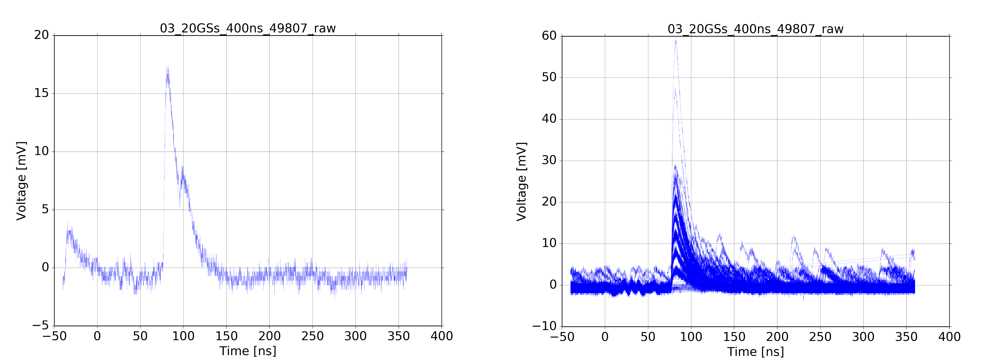
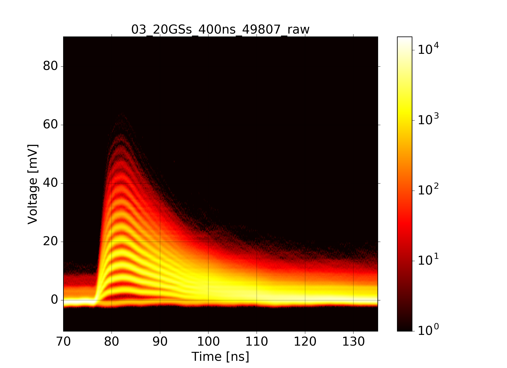

How to make transient_plots
***************************

The module transient_plots.py contains classes to read, plot
and analyse data-files from scope data.
The following plots are predefined:

Waveform - Plot
^^^^^^^^^^^^^^^

Here is an example how to create wafeform plots.
(Source code in file ``demo_waveform.py``, result in Fig. 3.1).

.. code-block:: python
    :linenos:

    #!/usr/bin/env python3
    # -*- coding: utf-8 -*
    from pyhaha import *                   # Environment variable $PYTHONPATH
                                           # points to relevant folder
    data_dir = './data_dir'
    filename = '03_20GSs_400ns_49807_raw'  # the Base-Name
    sd = ScopeData(filename, data_dir)     # create a ScopeData object
    sd.print_filenames()                   # call a ScopeData method
    sd.print_props()                       # call a ScopeData method

    p = WaveformPlot(sd)                   # create a standard plot object
    p.make_plot(data_slot=50)              # create a single-waveform plot
    p.save_plot('plot_waveform_single')    # save plot
    plt.close()                            # clear plot, prepare for new one
    p.make_plot()                          # create a mulit-waveform plot
    p.save_plot('plot_waveform_multi')     # save plot
    plt.show()                             # show plot

    Wafeform-plots based on single (left) and mutilple (right) waveforms

Spectrum - plot
^^^^^^^^^^^^^^^

Here is an example how to create a simple spectrum plot.
(Source code in file ``demo_spectrum.py``, result in Fig. 3.2).

.. code-block:: python
    :linenos:

    #!/usr/bin/env python3
    # -*- coding: utf-8 -*-
    from pyhaha import *                   # Environment variable $PYTHONPATH
                                           # points to relevant folder
    data_dir = './data_dir'
    filename = '03_20GSs_400ns_49807_raw'  # the Base-Name
    sd = ScopeData(filename, data_dir)     # create a ScopeData object
    sd.print_filenames()                   # call a ScopeData method
    sd.print_props()                       # call a ScopeData method

    p = SpectrumPlot(sd)                   # create a standard plot object
    p.make_plot()                          # create a plots with default params
    #p.make_plot(2200, 3500)               # create all plots with index range
    p.save_plot('plot_spectrum')           # save plot
    plt.show()                             # show plot

    Spectrum Plot

